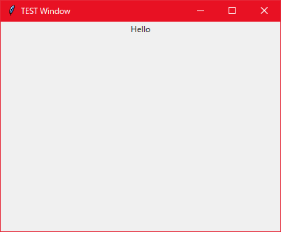

# TkSugar

A module that generates a structured Tk window frame from a text file.

```python
from tksugar.generator import Generator

gen = Generator()
gen.string = """
_Tk:
  title: "TEST Window"
  geometry: 400x300
  _Frame:
    pack:
    _Label:
      text: "Hello"
      pack:
"""
window = gen.generate()
window.mainloop()
```
->

